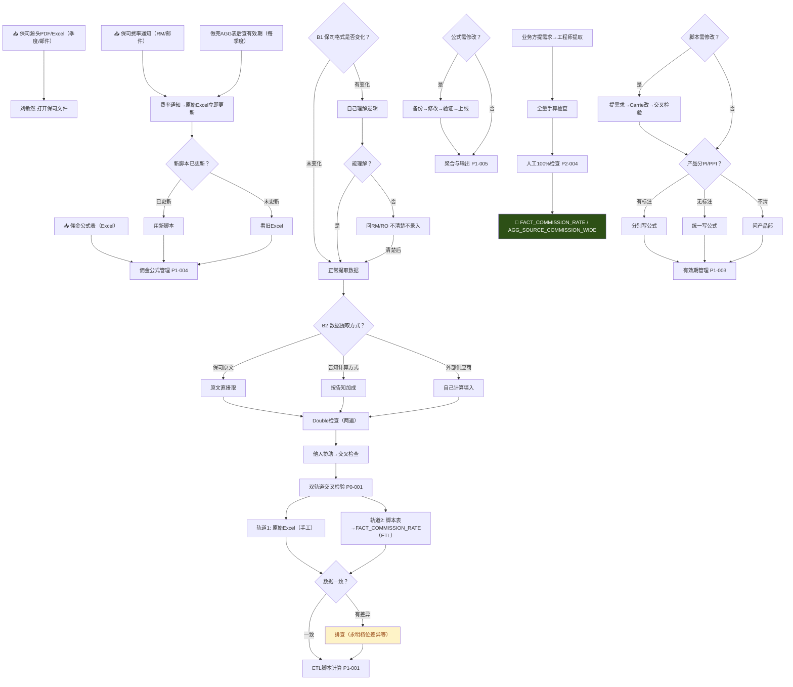

# EFA003-A_完整分析报告_刘敏然_VN-PAY-01_v1.0

> **任务包**：TASK-M4W10-055-扩展 | **执行终端**：opencode-deepseek | **日期**：2026-06-03
> **方法论**：数据规则提取方法论·三层递进提取法 v2.4
> **分析对象**：刘敏然·中台支持 × VN-PAY-01 · COM-01（季度源头佣金录入）
> **分析范围**：1个岗位 / 7条规则 / 5张数据表 / COM-01端到端录入链
> **输入文件**：
>   ① 方法论：上下文_数据规则提取方法论_三层递进提取法_v2.4.md
>   ② 规则空白地图：巡检产出_EFA005-V2_第一层产出_四标签+规则空白地图_VN-PAY-01_V1.md
>   ③ 规则清单：EFA003-A_规则清单_刘敏然_v1.2.md（含三轮访谈更新）
>   ④ D1-D6评分：EFA003-A_D1D6评分_刘敏然_v1.0.md（同任务产出）
>   ⑤ 工作流程图：EFA003-A_工作流程图_刘敏然_VN-PAY-01_v1.0.md（同任务产出）
>   ⑥ Gap解决评估报告：EFA003-A_Gap解决评估_二轮_v1.0.md
>   ⑦ 访谈记录：EFA-刘敏然（首轮）原文+导读 / EFA-GAP-刘敏然二轮 原文+导读 / 第三轮回复

---

## 第0节 · 执行摘要

| 维度 | 数值 |
|:---|:---|
| 执行路径 | 路径A+B融合（情景3，价值节点视角） |
| 分析范围 | 1个岗位 / 5张数据表 / 1个交付物（季度源头佣金表） |
| 访谈覆盖 | 3轮（首轮 + 二轮Gap补充 + 第三轮C类裁定/B类SOP，2026-06-03） |
| 规则提取总数 | 7条（全部已回填·待确认，0条已回填·明确） |
| 数据表锚点覆盖率 | 100%（7/7条规则均含表名.字段名） |
| Gap处理状态 | A类：10已关闭 / 8 SOP待获取 / 1挂起 / 1维持；B类：1 SOP待产出 / 7暂不执行；C类：1裁定完成 / 11挂起 |
| 最高风险项 | EFA-P0-004：源头PDF无OCR/验收标准，D1=0分（全报告最低） |

### 核心发现

1. **全部规则待确认**：7条规则均为"已回填·待确认"——B类（8条Gap暂不执行）+C类（11条Gap裁定挂起）未闭环，无法升级为"明确"。但规则正文已基于三轮访谈完整提取，内容充分。

2. **自动化程度极低**：7条全部Hybrid级（5-9分），0条Aug/Auto。D4均分0.1——仅P1-001因ETL脚本半自动化得1分，其余全部为0。外部依赖全部为PDF邮件/Excel/人工沟通。

3. **双轨道校验是核心防御机制**：刘敏然自建的"原始Excel表+脚本表"双轨道交叉检验（P0-001 D5=2分），是ETL脚本不可靠背景下的人工兜底。但该机制由刘敏然一人执行，交叉检查因人员变动已弱化。

4. **P1-004（公式管理/9分）最接近Aug**：D2=3分说明备份→修改→验证→上线流程已完全可SOP化，是7条规则中最具自动化潜力的。仅需解决D4（Carrie权限审批→系统化审批）即可突破10分。

### 分级结论

| 分级 | 条数 | 规则 |
|:---|:---:|:---|
| Auto（15-18） | 0 | — |
| Aug（10-14） | 0 | — |
| Hybrid（5-9） | 7 | P0-001(8), P0-004(4), P1-001(8), P1-003(6), P1-004(9), P1-005(5), P2-004(7) |
| Human（0-4） | 0 | — |

### 建议优先行动

| # | 行动项 | 对应规则 | 预期效果 |
|:---:|:---|:---|:---|
| 1 | 获取8份待确认SOP书面版 | 多项 | A类8条"📋SOP待获取"转为已关闭 |
| 2 | 推进B类8条Gap闭环（Carrie/工程师访谈） | P0-001/P1-001/P1-003/P1-005 | 消除SPOF/回归测试/双倍计算风险 |
| 3 | P1-004公式管理SOP落地 | P1-004 | 最高D2(3分)+D5(2分)，最接近Aug |
| 4 | 评估OCR/结构化提取可行性 | P0-004 | D1从0提升，当前D1均分最低 |

---

## 第1节 · 岗位-交付物-数据表映射总表

### 刘敏然·中台支持（COM-01 季度源头佣金录入）

| 交付物 | L4编码 | 关联数据表 | 表角色 | 执行方式 |
|:---|:---|:---|:---|:---|
| 季度源头佣金表 | COM-01 | 佣金准入表 | 过程表 | 全人工 → 半自动（ETL过渡中） |
| | | FACT_COMMISSION_RATE | 事实表 | 半自动（ETL脚本） |
| | | CONFIG_PRODUCT_COMMISSION_FORMULA | 参数表 | 全人工 |
| | | AGG_SOURCE_COMMISSION_WIDE | 聚合表 | 半自动（ETL脚本） |
| | | DIM_COMMISSION_RATE | 维度表 | 全人工 |

---

## 第2节 · 逐岗位详细分析

### 2.1 岗位：刘敏然·中台支持

**岗位定位**：佣金数据链的入口岗——从保司PDF/Excel提取佣金数据，经公式计算和ETL脚本处理，产出FACT_COMMISSION_RATE和AGG_SOURCE_COMMISSION_WIDE供下游（对账/应派）使用。双轨道校验（原始Excel+脚本表）是当前系统不可靠背景下的核心人工防御机制。

---

#### 2.1.1 交付物：季度源头佣金表（COM-01）

##### 关联数据表（四标签摘要）

| 数据表 | 表类型 | 责任模式 | 验证状态 | 商业职能 |
|:---|:---|:---|:---|:---|
| 佣金准入表 | 过程表 | 🟡 治理真空（Owner/Steward未定义） | ❌ 无复核 | 🟡 财务结算 |
| FACT_COMMISSION_RATE | 事实表 | 🟡 准三权合一（Owner=刘敏然，ETL写入） | ❌ 单人交叉检验 | 🟡 财务结算 |
| CONFIG_PRODUCT_COMMISSION_FORMULA | 参数表 | 🟡 交接模糊 | ❌ 备份机制存在但非系统化 | 🟡 财务结算 |
| AGG_SOURCE_COMMISSION_WIDE | 聚合表 | 🔴 治理真空（Owner/Steward空） | ❌ 全量人工检查 | 🟡 财务结算 |
| DIM_COMMISSION_RATE | 维度表 | 🟡 交接模糊 | ❌ 手工维护 | 🟡 财务结算 |

##### 工作流程图



##### 规则清单

| 编号 | 主题 | 概要 | 数据表锚点 | 外化 | 方式 | 完整度 |
|:---|:---|:---|:---|:---|:---|:---:|
| P0-001 | 佣金准入表→数据表切换 | 双轨道交叉检验：原始Excel+脚本表并行，永明档位差异（2A vs RA-D） | DIM_COMMISSION_RATE / FACT_COMMISSION_RATE | 口头 | 全人工 | 待确认 |
| P0-004 | 源头PDF→标准化录入 | 无OCR，手工录入+double检查。永明最难/太平洋最简单 | FACT_COMMISSION_RATE | 口头 | 全人工 | 待确认 |
| P1-001 | ETL责任边界 | 提需求→Carrie改→交叉检验。PI/PPI区分：有标注则分，无则不分 | FACT_COMMISSION_RATE / 公式文档 | 已文档 | 半自动 | 待确认 |
| P1-003 | 有效期重叠冲突 | 季度检查+AGG表后查。立即更新原始Excel。空档期看旧Excel | FACT_COMMISSION_RATE.生效期起/止 | 口头 | 全人工 | 待确认 |
| P1-004 | 公式冲突解决 | 备份→修改→验证→上线。effective start/end time季度区间 | CONFIG_PRODUCT_COMMISSION_FORMULA | 口头 | 全人工 | 待确认 |
| P1-005 | 聚合逻辑 | 业务方需求决定表头，工程师提取，全量手算检查 | AGG_SOURCE_COMMISSION_WIDE | 口头 | 全人工 | 待确认 |
| P2-004 | 公式错误检测 | 人工100%检查+录音交接。新人1-2月上手（常见1月/永明1.5-2月） | FACT_COMMISSION_RATE / 公式文档 | 已文档 | 全人工 | 待确认 |

---

## 第3节 · 规则完整度热力图

| 编号 | 优先级 | 回填状态 | 方式 | D1 | D2 | D3 | D4 | D5 | D6 | 总分 | 分级 | 完整度 |
|:---|:---:|:---|:---|:---:|:---:|:---:|:---:|:---:|:---:|:---:|:---|:---:|
| P0-001 | P0 | 🟡 待确认 | 全人工 | 1 | 2 | 2 | 0 | 2 | 1 | 8 | Hybrid | ✅ |
| P0-004 | P0 | 🟡 待确认 | 全人工 | 0 | 1 | 1 | 0 | 1 | 1 | 4 | Hybrid | ✅ |
| P1-001 | P1 | 🟡 待确认 | 半自动 | 1 | 2 | 2 | 1 | 1 | 1 | 8 | Hybrid | ✅ |
| P1-003 | P1 | 🟡 待确认 | 全人工 | 1 | 2 | 1 | 0 | 1 | 1 | 6 | Hybrid | ✅ |
| P1-004 | P1 | 🟡 待确认 | 全人工 | 1 | 3 | 2 | 0 | 2 | 1 | 9 | Hybrid | ✅ |
| P1-005 | P1 | 🟡 待确认 | 全人工 | 1 | 1 | 2 | 0 | 0 | 1 | 5 | Hybrid | ✅ |
| P2-004 | P2 | 🟡 待确认 | 全人工 | 1 | 2 | 2 | 0 | 1 | 1 | 7 | Hybrid | ✅ |

**图例**：P0=最高优先 | Hybrid=人主导+Agent辅助 | 红色D4=瓶颈维度

---

## 第4节 · D1-D6分级总表

### 维度均分与瓶颈分析

| 维度 | 均分 | 最高分 | 瓶颈分析 |
|:---|:---:|:---|:---|
| D1 输入结构化 | 0.9 | P0-001/P1-001等(1) | 全部输入为PDF/Excel，保司格式差异大，无API |
| D2 决策规则清晰度 | 1.9 | P1-004(3) | 规则较清晰，P1-004修改流程完全可编码 |
| D3 输出可验证性 | 1.7 | 5条规则(2) | 交叉检验机制普遍存在，但全人工执行 |
| D4 外部依赖API化 | **0.1** | P1-001(1) | **最大瓶颈**：所有外部交互为邮件/Excel/人工沟通 |
| D5 失败降级可用性 | 1.1 | P0-001/P1-004(2) | 备份+双轨道提供基础降级 |
| D6 合规约束可编码 | 1.0 | 全部(1) | 全部为业务规则，无明确监管合规要求 |

### 整体画像

- **Automation Readiness**：7条全部Hybrid——比蔡依娜（2 Aug/10+11分）自动化程度更低
- **核心制约**：D4均分0.1，仅P1-001因ETL脚本半自动化得1分，其余全部为0
- **与蔡依娜对比**：蔡依娜的P0-002（IA校验/10分Aug）和P1-009（审批流/11分Aug）因企业微信审批半自动化在D4得2分。刘敏然缺少任何系统管道，D4得分极低
- **最具升级潜力**：P1-004（Hybrid/9分），D2=3分+D5=2分，仅D4=0为瓶颈。若Carrie权限审批实现系统化，可突破10分→Aug

### 分级分布

| 分级 | 条数 | 占比 | 规则编号 |
|:---|:---:|:---:|:---|
| Auto（15-18） | 0 | 0% | — |
| Aug（10-14） | 0 | 0% | — |
| Hybrid（5-9） | 7 | 100% | 全部 |
| Human（0-4） | 0 | 0% | — |

---

## 第5节 · 残余Gap与风险清单

### 5.1 Gap处理汇总（来源：Gap解决评估_二轮v1.0 + 规则清单v1.2）

**A类Gap（13条，首轮→二轮评估）**：

| 评估结论 | 条数 | 说明 |
|:---|:---:|:---|
| ✅ 已解决 | 7 | A-010/018/020/022/023/031/032（经二轮访谈直接回答或补充） |
| 🟡 部分解决 | 6 | A-001/003/006/014/016/033（规则正文已补充，但关键要素仍缺失） |

**A类Gap（v1.2第三轮状态更新）**：

| 状态 | 条数 | 说明 |
|:---|:---:|:---|
| 已关闭 | 10 | v1.2新增A-010/018/032关闭 |
| SOP存在待获取 | 8 | 刘敏然确认有SOP，待获取书面版 |
| 挂起·等脚本版本确定 | 1 | A-003 |
| 维持原状 | 1 | A-033（知识库） |

**B类Gap（8条，v1.2状态）**：

| 状态 | 条数 | 说明 |
|:---|:---:|:---|
| SOP待产出 | 1 | A-011（ETL流程SOP） |
| 暂不执行 | 7 | 待Carrie/工程师后续访谈闭环 |

**C类Gap（12条，v1.2状态）**：

| 状态 | 条数 | 说明 |
|:---|:---:|:---|
| 裁定已完成 | 1 | A-021（新字段添加→Carrie负责） |
| 裁定挂起·不阻塞 | 11 | Mark暂不裁定 |

### 5.2 风险清单

| # | 风险描述 | 等级 | 规则 | 建议行动 |
|:---:|:---|:---:|:---|:---|
| R1 | **D4均分0.1**：所有外部依赖为人工作业，无API通道。保司PDF邮件、Carrie人工改脚本、RM口头沟通 | 🔴 高 | 全部 | 优先评估OCR/API化方案 |
| R2 | **双轨道校验SPOF**：交叉检验刘敏然一人执行，交叉检查因人员变动已弱化 | 🟡 中 | P0-001 | 恢复多人交叉检查或增设B角 |
| R3 | **新脚本推广受阻**：财务/结算人员"看不太懂"新脚本表，仍以旧Excel为准 | 🟡 中 | P1-003 | 培训新脚本表阅读+逐步推广 |
| R4 | **FIC双倍计算风险**：Commission plan+license call组合不唯一时可能导致双倍计算，预防机制未建立 | 🟡 中 | P1-005 | 增加聚合唯一性校验 |
| R5 | **无自动公式检测**：公式错误依赖人工100%检查，永明多档位倒推是最难点 | 🟡 中 | P2-004 | 评估自动一致性校验脚本 |
| R6 | **保单级追溯缺失**：宽表只到产品级别，不含保单号 | 🟢 低 | P1-005 | 评估宽表增加保单号字段 |
| R7 | **8份SOP待获取**：刘敏然确认有书面SOP但尚未获取，阻碍Gap关闭 | 🟢 低 | 多项 | 批量获取书面版SOP |

---

## 第6节 · SOP梳理

> **说明**：按方法论v2.4 Section 8规定，仅对Auto/Aug级规则优先梳理SOP。本报告无Aug/Auto级规则，以下为**建议SOP范围**——基于D2最高分的P1-004（Hybrid/9分），最接近Aug等级。**本SOP为「方法论验证产出」，非最终SOP。**

---

### SOP-001（建议）：佣金公式修改SOP（P1-004 · Hybrid/9分）

**目的**：规范佣金公式表（CONFIG_PRODUCT_COMMISSION_FORMULA）的修改流程，确保每次修改有备份可回滚、有验证可追溯、有新字段审批链。

**适用范围**：刘敏然岗位，当保司计算方式改变或需要新增佣金计算维度时触发。季度内通常不改公式。

**角色与职责**：
| 角色 | 职责 |
|:---|:---|
| 刘敏然·中台支持 | 发起修改、执行备份、修改公式、交叉验证 |
| RM | 提供具体公式，确认计算逻辑 |
| Carrie·市场支持 | 新字段添加时负责权限审批与执行 |
| 工程师 | ETL脚本侧同步修改（如需要） |

**前置条件**：
1. 保司佣金计算方式变更已确认（RM书面或邮件）
2. 佣金公式表当前版本已备份
3. effective_start_time和effective_end_time已确定

**流程图**：
```
保司计算方式变更通知
        ↓
备份当前公式表
        ↓
修改公式（effective start/end time划分）
        ↓
新字段？──→ Carrie权限审批
        ↓
验证：旧Excel vs 新脚本校对
   + 问RM确认公式
        ↓
验证通过？──→ 否 → 回滚到备份 → 重新修改
        ↓ 是
上线（季度内不改公式）
        ↓
通知下游
```

**步骤说明**：
1. 备份当前佣金公式表（保存完整副本）
2. 按保司变更要求修改该保司对应的公式
3. 用effective_start_time/end_time划分生效期（一个季度一个新表）
4. 如需新增字段→Carrie负责权限审批与执行
5. 验证：旧Excel计算结果 vs 新脚本计算结果校对 + 问RM确认公式
6. 上线并通知下游

**合规节点**：新字段添加需Carrie审批（v1.2已裁定）。季度内通常不改公式，生效期不变。

**常见问题**：
- Q：验证不通过怎么办？→ 回滚到备份版本，排查差异原因后重新修改
- Q：季度内紧急变更怎么办？→ 需Carrie审批，走例外流程

---

## 附录A · 规则空白地图（最终填充状态）

> 来源：EFA005-V2 第一层产出 Section A，刘敏然归口部分（COM-01）。填充状态与规则清单v1.2同步。

| 优先级 | 价值节点 | 表名 | 规则空白描述 | 空白类型 | 填充状态 | 执行方式 |
|:---:|:---|:---|:---|:---:|:---|:---|
| P0 | VN-PAY-01 | 佣金准入表→fact_commission_rate | 佣金准入表已被数据表替代但切换规则与迁移规则未定义 | ❌缺口 | 🟡 待确认 | 全人工 |
| P0 | VN-PAY-01 | 源头PDF→佣金准入表 | 无OCR/验收标准，保司格式不统一 | ❌缺口 | 🟡 待确认 | 全人工 |
| P1 | VN-PAY-01 | fact_commission_rate | ETL责任边界不清（Owner挂名+ETL写入） | ❓潜在 | 🟡 待确认 | 半自动 |
| P1 | VN-PAY-01 | fact_commission_rate | 有效期重叠冲突解决规则缺失 | ❌缺口 | 🟡 待确认 | 全人工 |
| P1 | VN-PAY-01 | config_product_commission_formula | 公式冲突解决规则缺失 | ❌缺口 | 🟡 待确认 | 全人工 |
| P1 | VN-PAY-01 | agg_source_commission_wide | 聚合逻辑缺乏业务确认 | ❌缺口 | 🟡 待确认 | 全人工 |
| P2 | VN-PAY-01 | fact_commission_rate | 公式错误检测机制缺失 | ❌缺口 | 🟡 待确认 | 全人工 |

**填充完成度**：7条规则全部已填充（100%），回填状态全部为「已回填·待确认」（B类/C类Gap未闭环）。

---

## 附录B · 字段级规则信号清单

> 来源：EFA005-V2 第四节 C1-C5信号清单，刘敏然归口COM-01部分。

| 表名 | 字段名 | 规则编号 | 信号 | 说明 |
|:---|:---|:---|:---:|:---|
| 佣金准入表 | 全部47字段 | P0-001, P0-004 | C1 | 原手工录入，ETL替代中。保司格式不统一 |
| FACT_COMMISSION_RATE | fyc_rate | P1-001, P2-004 | C2 | ETL计算字段，公式版本标记缺失 |
| FACT_COMMISSION_RATE | ryc_rate | P1-001, P2-004 | C2 | 续期公式可能误用首期系数 |
| FACT_COMMISSION_RATE | effective_start_date | P1-003 | C1, C3 | 人工维护+季度检查，有效期重叠解决规则缺失 |
| FACT_COMMISSION_RATE | effective_end_date | P1-003 | C1, C3 | 同上 |
| CONFIG_PRODUCT_COMMISSION_FORMULA | first_year_formula | P1-004 | C2, C3 | 公式字段+按需更新，语法通过但逻辑错误无法检测 |
| CONFIG_PRODUCT_COMMISSION_FORMULA | renewal_year_formula | P1-004 | C2, C3 | 续期公式变更长期影响支出 |
| AGG_SOURCE_COMMISSION_WIDE | commission_plan_code | P1-005 | C2 | ETL聚合字段，聚合函数选择风险 |
| AGG_SOURCE_COMMISSION_WIDE | fyc_rate | P1-005 | C2 | 聚合逻辑错误风险，Owner/Steward为空 |

---

## 附录C · 补充行动清单

> 整合自规则清单v1.2下一步行动 + Gap评估报告v1.0建议。

| # | 行动项 | 规则 | 责任方 | 优先级 | 来源 |
|:---:|:---|:---|:---|:---:|:---|
| 1 | 获取8份SOP书面版 | 多项 | 刘敏然 | 高 | v1.2 A类更新 |
| 2 | Carrie/工程师访谈（B类8条闭环） | P0-001/P1-001/P1-003/P1-005 | Carrie/工程师 | 高 | v1.2 B类 |
| 3 | Mark裁定C类11条挂起 | 多项 | Mark | 中 | v1.2 C类 |
| 4 | 新脚本培训+推广 | P1-003 | 刘敏然/Carrie | 中 | Gap评估 |
| 5 | OCR/结构化提取可行性评估 | P0-004 | Carrie/IT | 中 | Gap评估 |
| 6 | 产品部PI/PPI完整清单获取 | P1-001 | 产品部 | 低 | Gap评估 |
| 7 | 知识库建立（保司源文件+公式） | P2-004 | Carrie | 低 | Gap评估 A-033 |
| 8 | P1-004公式修改SOP正式产出 | P1-004 | 刘敏然/Carrie | 中 | 本报告第6节 |

---

## 附加观察

1. **与蔡依娜岗位的对比**：蔡依娜10条规则中有2条Aug（P0-002 IA校验/10分 + P1-009 审批流/11分），刘敏然0条Aug。核心差距在D4——蔡依娜有企业微信审批流（D4=2分）的半自动化通道，刘敏然缺少任何系统管道。

2. **Gap评估报告与规则清单的版本衔接**：Gap解决评估_二轮v1.0产出7条已解决+6条部分解决，推动了规则清单从v1.1→v1.2的升级。v1.2的第三轮更新（C类A-021裁定、B类A-011 SOP待产出、A类状态全面更新）是在评估报告基础上进行的额外闭环。

3. **访谈记录完整性**：首轮访谈（原文+导读）覆盖7条规则的基础规则提取，二轮Gap访谈（原文+导读）覆盖13条A类Gap追问，第三轮回复覆盖C类裁定和B类SOP确认。三轮访谈共同支撑了规则清单v1.2的完整正文。

4. **C类裁定处理**：12条C类Gap中仅A-021完成裁定（Carrie负责新字段审批），其余11条因Mark策略性延迟裁定标注为「裁定挂起·不阻塞」。这与蔡依娜的C类处理方式一致（GAP-005/GAP-018同样挂起）。

---

## 自检声明

**Done Criteria自检**：

- [x] 方法论文v2.4已完整读取（报告结构按第六节模板）
- [x] 7份输入文件已完整读取
  - 方法论v2.4 / 规则空白地图EFA005-V2 / 规则清单v1.2 / D1-D6评分v1.0 / 工作流程图v1.0 / Gap评估报告v1.0 / 访谈记录（首轮+二轮+三轮）
- [x] 报告包含第0-6节+附录A/B/C，结构完整
- [x] 第0节执行摘要包含核心发现（4条）+分级结论+优先行动（4项）
- [x] 第1节映射总表覆盖全部COM-01交付物（5张数据表）
- [x] 第2节工作流程图已正确引用（Mermaid格式，11个判断节点）
- [x] 第2节规则清单含数据表锚点（7条规则，每条含表名.字段名）
- [x] 第3节热力图7条规则全覆盖
- [x] 第4节D1-D6分级总表与评分文件一致
- [x] 第5节风险清单引用Gap评估报告与规则清单v1.2，共7条风险+A/B/C Gap状态
- [x] 第6节仅对最接近Aug的P1-004出SOP结构，注明「方法论验证产出」
- [x] 附录A规则空白地图7条全部标注为待确认
- [x] 附录B字段信号清单含9条字段记录
- [x] 附录C补充行动清单含8条（含来源标注）
- [x] 附加观察含与蔡依娜岗位对比

---

*执行终端：opencode-deepseek | 日期：2026-06-03 | 版本：v1.0*
