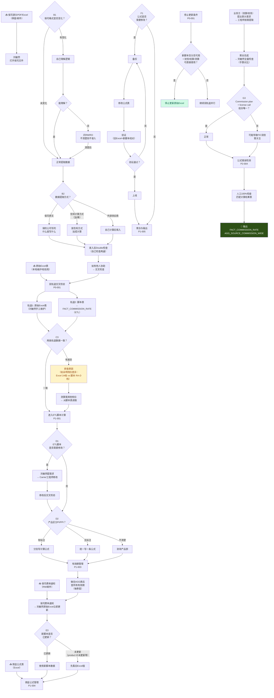

# EFA003-A_工作流程图_刘敏然_VN-PAY-01_v1.0

> **上游输入**：EFA003-A_规则清单_刘敏然_v1.2.md（7条规则 · COM-01季度源头佣金录入）
> **分析对象**：刘敏然·中台支持 × VN-PAY-01（COM-01源头佣金录入链）
> **起点A → 终点Z**：保司源头佣金PDF/Excel（季度） → fact_commission_rate / agg_source_commission_wide
> **流程节点来源**：100%基于规则清单v1.2的「如果…则…」规则正文

---

## 一、文字版流程（阶段对照）

### 阶段A：外部输入就绪

| 输入项 | 来源 | 获取方式 | 关联规则 |
|:---|:---|:---|:---:|
| 保司源头PDF/Excel | 保险公司 | 邮件/季度发送 | P0-004 |
| 保司费率通知 | 保险公司/RM | 邮件/即时通知 | P1-003 |
| 原始Excel表（校验用） | 刘敏然自有 | 本地维护 | P0-001 |
| 佣金公式表 | 刘敏然自有 | Excel | P1-004 |
| PI/PPI产品分类 | 产品部 | 人工咨询 | P1-001 |

### 阶段B：源头数据提取与录入（P0-004 / P0-001）

**B1 · 接收保司文件**
1. 保司PDF/Excel到达 → 刘敏然打开查看
2. 判断：保司格式是否变化？
   - 未变化 → 正常提取
   - 有变化 → 先自己理解逻辑
   - 无法理解 → 问RM/RO，不清楚则不录入

**B2 · 提取佣金数据**
1. 判断：数据提取方式？
   - 保险公司原文数据 → "保险公司写的什么我就写什么"
   - 保险公司告知计算方式（加/乘）→ 按告知方式加成计算
   - 外部供应商佣金 → 刘敏然自己计算后填入

**B3 · 录入后校验**
1. Double检查（自检两遍）
2. 如有他人协助录入 → 交叉检查
3. 主要检查佣金率 → 测算人员会倒推异常

### 阶段C：双轨道交叉检验（P0-001）

**C1 · 两条轨道**
- 轨道1：刘敏然原始Excel表（手工维护）
- 轨道2：脚本跑出的佣金准入表 → FACT_COMMISSION_RATE（ETL）

**C2 · 交叉检验**
1. 两条轨道数据并行对比
2. 判断：是否有差异？
   - 一致 → 进入下一步
   - 有差异 → 排查原因（永明档位差异：原始Excel只有2A档，脚本表有RA-D六个档位）
3. 差异处理：如果测算需要其他档位数据 → 从脚本表调取

### 阶段D：ETL脚本计算（P1-001）

**D1 · 脚本运行**
1. 判断：ETL脚本是否需要修改？
   - 是 → 刘敏然提需求 → Carrie/工程师修改 → 修改后交叉检验
   - 否 → 直接用现有脚本

**D2 · PI/PPI区分**
1. 判断：产品是否区分PI/PPI？
   - PDF有标注 → 分别写计算公式
   - PDF无标注 → 统一写一条计算公式
2. 区分不清 → 咨询产品部

**D3 · 修改流程**（SOP待产出）：需求 → 开发 → 测试 → 上线

### 阶段E：有效期管理（P1-003）

**E1 · 季度检查**
1. 做完AGG表后 → 查所有有效期
2. 判断：有效期是否有问题？
   - 正常 → 通过
   - 异常（如2026写成120）→ 修正
3. 保司费率更新 → 刘敏然原始Excel立即更新

**E2 · 空档期处理**
1. 判断：新脚本是否已更新？
   - 已更新 → 使用新脚本数据
   - 未更新（product ID未更新等原因）→ 先看旧Excel版

### 阶段F：佣金公式管理（P1-004）

**F1 · 公式修改流程**
1. 判断：公式是否需要修改？
   - 保司计算方式改变 → 修改该保司对应公式
   - 季度内不改公式

**F2 · 修改步骤**：备份 → 修改 → 验证（旧Excel和新脚本校对）→ 上线

**F3 · 新字段添加**
1. 需要新增字段 → Carrie负责权限审批与执行
2. 使用effective_start_time和effective_end_time划分生效期

### 阶段G：聚合与输出（P1-005）

**G1 · 宽表聚合**
1. 业务方（测算/财务）提出表头需求 → 工程师按需提取
2. 聚合完成 → 刘敏然全量检查（手算对比）
3. 判断：是否有双倍计算？
   - Commission plan + license call组合唯一 → 正常
   - 不唯一 → 可能导致FIC双倍

**G2 · 停止更新条件**（P0-001）
新脚本百分百可用 + 财务/结算/测算可直接使用 → 可停止更新原始Excel

### 阶段H：公式错误检测与交接（P2-004）

**H1 · 检测**：人工100%检查，通过匹配计算结果表验证

**H2 · 交接**：录音交接 + 计算公式文档 + 保司PDF样本 + 举例计算
- 新人上手：常见保司1个月 / 复杂保司1.5-2个月

---

## 二、Mermaid流程图

---

## 三、判断节点汇编

| 节点ID | 判断内容 | 所属规则 | 是→动作 | 否→动作 |
|:---|:---|:---:|:---|:---|
| B1 | 保司格式是否变化？ | P0-004 | 正常提取 | 自己理解→问RM |
| B1b | 能理解新格式？ | P0-004 | 正常提取 | 问RM/RO，不清楚不录入 |
| B2 | 数据提取方式？ | P0-001 | 原文/加成/自算 | — |
| C3 | 两条轨道数据一致？ | P0-001 | 进入ETL | 排查原因（如档位差异） |
| D1 | ETL脚本是否需要修改？ | P1-001 | 提需求→修改→交叉检验 | 直接用 |
| D2 | 产品区分PI/PPI？ | P1-001 | 分别写/统一写/问产品部 | — |
| E3 | 新脚本是否已更新？ | P1-003 | 用新脚本数据 | 先看旧Excel版 |
| F1 | 公式是否需要修改？ | P1-004 | 备份→修改→验证→上线 | 进入聚合 |
| F1d | 验证是否通过？ | P1-004 | 上线 | 返回备份重新修改 |
| G3 | Commission plan+license call唯一？ | P1-005 | 正常 | 关注FIC双倍风险 |
| H2a | 新脚本百分百可用？ | P0-001 | 停止更新原始Excel | 继续双轨道并行 |

**判断节点总数**：11个

---

## 四、风险节点标注

| 风险类型 | 节点 | 说明 |
|:---|:---|:---|
| 🟡 SPOF单人 | B3/B4 | Double检查和交叉检查均由刘敏然一人执行，交叉检查因人员变动已弱化 |
| 🟡 外部依赖 | D1a | ETL修改依赖Carrie/工程师，无SLA |
| 🟡 空档期风险 | E3b | 新脚本未更新期间依赖旧Excel，正式推广受阻 |
| 🟡 双倍计算风险 | G3b | Commission plan+license call不唯一可能导致FIC双倍，预防机制未建立 |
| 🟡 无自动检测 | H0/H1 | 公式错误依赖人工100%检查，无自动检测 |

---

## 五、自检声明

- [x] 规则清单v1.2已完整读取（7条规则正文全部覆盖）
- [x] 文字版流程已输出（阶段A→H）
- [x] Mermaid流程图已输出（11个判断节点）
- [x] 判断节点全部标注if-else逻辑
- [x] 各节点关联规则编号
- [x] 风险节点已标注

---

*执行终端：opencode-deepseek | 日期：2026-06-03 | 版本：v1.0*
