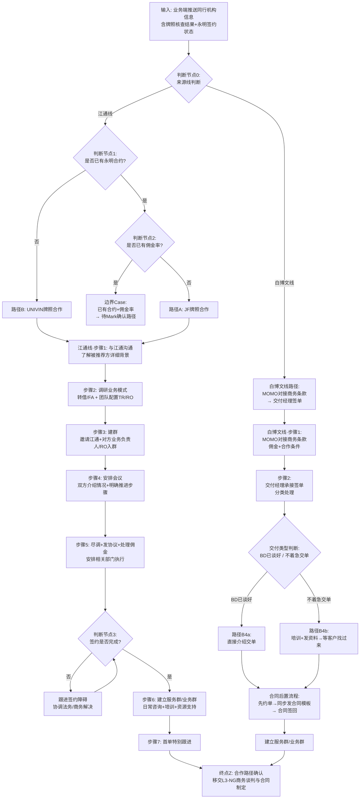

# JF/UNIVIN 合作路径决策树

> **文档编号**: A-02  
> **版本**: v1.1 | 日期：2026-06-01  
> **来源**: 菲菲访谈记录（批次6，2026-05-28）+ VN-IBRD-01 价值节点详情卡  
> **用途**: VN-IBRD-01补建·Gate②落地凭证  
> **负责人**: 赵琦（Jasper）  

---

## 一、适用范围

本决策树适用于**同行机构合作路径判断**，覆盖从业务端推送同行机构信息到合作路径确认的全过程。

**适用对象**: 
- 江通线：同行业中务条线负责人（菲菲）及 TR
- 白博文线：MOMO（商务条款对接）及交付经理（Uniwind同行签单）

**业务场景**: 经代/MGA 域同行机构引入  
**输入条件**: 前端渠道（江通）或业务端（白博文）已完成初步接触并转介至中台  

> **名称说明**: 本任务书使用"JF"指代调研记录中的"9付"牌照合作模式。"9付"为内部系统/产品名称，"JF"为品牌简称，二者指同一合作路径。统一使用"JF"以符合任务书规范。  
> **来源线说明**: 调研确认存在两条并行来源线——**江通线**（江通→菲菲→TR）和**白博文线**（白博文→MOMO→交付经理），两条路径执行标准不同，需分别处理。

---

## 二、判断节点（决策树正文）

### 2.1 主判断流程

### 2.2 判断节点说明

#### 判断节点0：来源线判断

| 维度 | 说明 |
|:---|:---|
| **判断条件** | 同行机构信息的推送来源 |
| **判断标准** | 业务端（江通）推送 → 江通线；业务端（白博文）推送 → 白博文线 |
| **判断人** | 信息接收人自动识别（系统标记或人工识别） |
| **输入物** | 同行机构信息 + 来源标识（江通/白博文） |
| **输出** | 江通线 / 白博文线 |
| **审批要求** | 无需审批，来源由前端渠道/业务端在推送时确定 |

#### 判断节点1：是否已有永明合约？

| 维度 | 说明 |
|:---|:---|
| **判断条件** | 牌照核查结果中"永明签约状态"字段 |
| **判断标准** | 核查同行机构是否已与永明签署合作协议 |
| **判断人** | 江通线：菲菲（同行业中务条线负责人）；白博文线：MOMO（商务条款对接） |
| **输入物** | 江通线：江通推送的牌照核查结果；白博文线：白博文推送的同行信息 |
| **输出** | 是/否 |
| **审批要求** | 无需额外审批，基于系统记录或前端提供的牌照截图直接判断 |

#### 判断节点2：是否已有佣金率？

| 维度 | 说明 |
|:---|:---|
| **判断条件** | 在"已有永明合约"为真的前提下，核查佣金率是否已约定 |
| **判断标准** | 系统中是否已配置该机构的佣金率参数 |
| **判断人** | 菲菲（同行业中务条线负责人） |
| **输入物** | 永明合约详情 + 佣金系统配置记录 |
| **输出** | 是/否 |
| **审批要求** | 无需额外审批，基于合约条款和系统配置直接判断 |

#### 判断节点3：签约是否完成？

| 维度 | 说明 |
|:---|:---|
| **判断条件** | 合同终稿是否双方签署生效 |
| **判断标准** | 合同管理系统中是否已归档双方签署的PDF法律文件 |
| **判断人** | 交付经理 / TR（负责签约执行的岗位） |
| **输入物** | 合同签署状态 + 系统归档记录 |
| **输出** | 是/否 |
| **审批要求** | 需法务确认合同条款合规性，双方授权代表签署 |

### 2.3 合作路径分支说明

| 路径 | 触发条件 | 合作模式 | 后续动作 |
|:---|:---|:---|:---|
| **路径A：JF牌照合作** | 已有永明合约，但无佣金率 | 使用JF（9付）牌照作为合作载体 | 按标准7步流程推进 |
| **路径B：UNIVIN牌照合作** | 无永明合约 | 通过UNIVIN牌照引入合作 | 按标准7步流程推进 |
| **边界Case：已有合约+佣金率** | 已有永明合约且已有佣金率 | **待Mark确认** — 调研中未覆盖此场景的处理方式 | 待确认后补充 |

### 2.4 标准7步流程（路径A/B共通）

| 步骤 | 动作 | 执行人 | 输入物 | 输出物 | 工具/系统 |
|:---|:---|:---|:---|:---|:---|
| **江通线** |||||
| 步骤1 | 与江通沟通了解被推荐方详细背景 | 菲菲 | 江通推送的同行机构信息 | 背景信息补充记录 | 微信/邮件 |
| 步骤2 | 调研业务模式（转借/FA）+团队配置（TR/RO等） | 菲菲 | 背景信息 + 公开资料 | 业务模式与团队配置记录 | 口头沟通+笔记 |
| 步骤3 | 建群邀请江通、对方业务负责人/RO入群 | 菲菲 | 双方联系方式 | 业务沟通群建立 | 微信企业群 |
| 步骤4 | 安排会议：双方介绍情况，明确合作推进步骤 | 菲菲 | 会议议程 | 会议纪要 + 合作推进计划 | 线下会议/腾讯会议 |
| 步骤5 | 尽调、发送协议、处理佣金 | 交付经理/TR + 法务/财务 | 尽调记录 + 协议模板 | 尽调报告 + 协议草案 + 佣金处理方案 | 滴滴流程系统 + 合同模板 |
| 步骤6 | 签约后建立服务群/业务群 | 交付经理/TR | 签约完成确认 | 服务群/业务群建立 | 微信企业群 |
| 步骤7 | 首单特别跟进 | 交付经理/TR | 首单执行计划 | 首单跟进记录 | 业务系统 + 微信 |
| **白博文线** |||||
| 步骤1 | MOMO对接商务条款（佣金、合作条件） | MOMO | 白博文推送的同行（经济行）信息 | 商务条款确认记录 | 微信/邮件 |
| 步骤2 | 交付经理承接签单，分类处理 | 交付经理 | 商务条款确认 + 产品资料包 | 签单分类处理方案 | 微信/邮件 |
| 步骤3a | BD已谈好：直接介绍交单（快） | 交付经理 | BD谈好的合作意向 | 交单执行 | 业务系统 |
| 步骤3b | 不着急交单：培训+发资料→等客户找过来（周期长） | 交付经理 | 产品资料包 | 培训完成记录 + 资料发送记录 | 微信/邮件 |
| 步骤4 | 合同后置：先约单→同步发合同模板→合同签回（1-2个月） | 交付经理 + 法务 | 约单确认 + 合同模板 | 合同签署版（PDF） | 滴滴流程系统 |
| 步骤5 | 建立服务群/业务群 | 交付经理 | 合同签回确认 | 服务群/业务群建立 | 微信企业群 |

---

## 三、审批节点清单

| 步骤 | 审批事项 | 审批人 | 审批方式 | 审批标准 |
|:---|:---|:---|:---|:---|
| **江通线审批节点** |||||
| 判断节点1 | 永明合约状态确认 | 菲菲 | 系统核查/牌照截图核验 | 系统记录或江通提供的官方截图 |
| 判断节点2 | 佣金率配置确认 | 菲菲 | 佣金系统查询 | 系统中已配置且生效的佣金率参数 |
| 江通·步骤4 | 会议安排与议程确认 | 菲菲 | 内部沟通确认 | 双方时间可协调，议程覆盖合作关键议题 |
| 江通·步骤5 | 协议条款合规性审查 | 法务 | 合同管理系统审批流 | 符合公司合同模板标准，无法律风险 |
| 江通·步骤5 | 佣金方案审批 | 财务/商务 | 佣金系统审批 | 佣金率符合公司政策，不突破底价 |
| **白博文线审批节点** |||||
| 白博文·步骤1 | 商务条款（佣金+合作条件）确认 | MOMO | 与业务端（白博文）+ 同行机构三方确认 | 佣金率符合政策，合作条件可执行 |
| 白博文·步骤4 | 合同模板发送审批 | 交付经理 + 法务 | 合同管理系统审批 | 合同条款符合模板标准，无异常条款 |
| **共通审批节点** |||||
| 判断节点3 | 合同签署生效 | 双方授权代表 | 电子签/纸质签 | 合同管理系统归档，双方盖章/签字完整 |
| 服务群建立 | 服务群/业务群成员确认 | 交付经理/TR | 内部确认 | 群成员覆盖必要岗位（业务+运营+法务） |

---

## 四、边界Case说明

### Case 1：已有永明合约且已有佣金率

**场景**: 同行机构已与永明签约，且系统中已配置佣金率。

**当前状态**: 调研中**未覆盖**此场景的处理方式。菲菲在实际执行中仅遇到"有合约无佣金率"和"无合约"两种情况，未明确"有合约+有佣金率"时的合作路径。

**待确认问题**:
- 此场景是否意味着该机构可直接走单，无需额外合作路径判断？
- 还是需要切换到其他合作模式（如直接产品对接）？
- 是否由江通线/白博文线分别处理？

**建议**: 请 Mark 确认此场景的业务规则后补充至决策树 v1.1。

### Case 2：同行机构同时持有多个牌照

**场景**: 同行机构既持有永明合约，又与其他保司有合作关系，或同时满足JF和UNIVIN的适用条件。

**当前状态**: 调研中未明确多牌照场景的处理优先级。

**待确认问题**:
- 多牌照时以哪个牌照为主合作载体？
- 是否存在牌照优先级规则（如永明优先、或按佣金率高低选择）？
- 是否需要并行推进多条合作路径？

**建议**: 请 Mark 确认多牌照场景的规则后补充至决策树 v1.1。

### Case 3：江通线 vs 白博文线的来源分流（已确认）

**场景**: 同行机构信息来源不同（江通推送 vs 白博文推送），实际执行中由不同岗位承接（菲菲 vs MOMO→交付经理）。

**当前状态**: 批次7调研已确认两条线并行，执行标准**不一致**。

**两条线对比**:

| 维度 | 江通线 | 白博文线 |
|:---|:---|:---|
| **来源** | 江通（前端渠道） | 白博文（Uniwind市场拓展负责人） |
| **对接人** | 菲菲 | MOMO（商务条款）→ 交付经理（签单） |
| **执行路径** | 7步标准流程（沟通→调研→建群→会议→尽调→签约→首单） | 合同后置（培训→约单→后发合同） |
| **合同顺序** | 先尽调/发协议，再签约 | 先约单/培训，再发合同（合同后置） |
| **判断逻辑** | JF/UNIVIN路径判断 | 未明确使用JF/UNIVIN判断，直接由MOMO对接商务条款 |
| **痛点** | 无标准化决策模板 | 合同后置导致签完不出单；与TR职责重叠 |

**处理建议**:
- 江通线：由菲菲直接对接，执行 JF/UNIVIN 判断 + 7步标准流程
- 白博文线：由 MOMO 对接商务条款，交付经理执行合同后置签单流程
- **关键差异**: 白博文线目前**未明确使用**"JF/UNIVIN"合作路径判断逻辑，而是直接由MOMO根据商务条款决定合作方式

### Case 4：合同后置的适用范围与风险控制

**场景**: 白博文线实际执行中采用"合同后置"策略（先约单/培训，再发合同），与SOP中"合同签署应在出单前完成"不一致。

**当前状态**: 批次7调研确认合同后置是交付经理的实际执行方式，理由为"之前先发合同后不出单"。

**风险**:
- 签完合同不出单，合同失去约束力意义
- 合同签回周期长达1-2个月，影响合作推进效率
- 无明确的后置策略适用范围（是否仅白博文线？是否江通线也可后置？）

**待确认问题**:
- 合同后置是否是公司统一策略？还是仅白博文线的权宜之计？
- 后置策略是否需要在江通线推广？
- 如何控制后置策略的履约风险（如不出单时的合同处理）？

---

## 五、待确认事项

| # | 待确认事项 | 提出依据 | 建议确认人 | 影响范围 |
|:---|:---|:---|:---|:---|
| 1 | "9付"是否统一更名为"JF"？ | 任务书使用"JF"，调研记录使用"9付" | Mark / 菲菲 | 文档命名、系统配置、对外沟通 |
| 2 | 已有合约+佣金率场景的处理路径 | 调研未覆盖 | Mark | 决策树完整性 |
| 3 | 多牌照机构的合作路径优先级 | 调研未覆盖 | Mark | 复杂场景处理 |
| 4 | 白博文线是否需纳入JF/UNIVIN判断逻辑 | 批次7确认白博文线由MOMO直接对接商务条款，未使用JF/UNIVIN判断 | Mark / 菲菲 | 跨线一致性：两条线是否统一判断标准？ |
| 5 | 尽调步骤是否应归属L3-IBRD还是独立L4 | 调研发现尽调归属不明 | Terresa | L4架构调整 |
| 6 | 需求诊断模板的标准化内容 | 当前无标准化模板 | 菲菲 / Terresa | VN-IBRD-01补建 |
| 7 | 签约后服务群的管理标准与交付清单 | 当前服务群管理混乱 | 菲菲 / Terresa | 运营规范化 |
| 8 | 合同后置是否是公司统一策略 | 批次7确认白博文线合同后置，与SOP不一致 | Mark / 交付经理 | 流程合规性：统一前置还是允许后置？ |
| 9 | 交付经理与TR的职责边界 | 批次7确认交付经理实际工作与TR高度重叠 | Mark / Terresa | 岗位设计：交付经理是否有独立增值职责？ |
| 10 | 是否建立统一的同行对接入口 | 批次7确认两条路径并行且无统一归口 | Mark / Terresa | 管理效率：多入口导致信息不透明 |

---

## 六、自检声明

**Done Criteria 逐项自检**:

- [x] 三份输入文件已完整读取（方法论v2.4、调研记录V1.0、价值节点清单）
- [x] 批次7补充调研已读取（交付经理视角，2026-06-01）
- [x] 决策树主判断流程已产出（Mermaid格式，含两条来源线）
- [x] 判断节点 ≥ 2个（实际4个：来源线判断、永明合约判断、佣金率判断、签约完成判断）
- [x] 每个判断节点有：条件/标准/审批人/输出
- [x] 审批节点清单已产出（9个审批节点）
- [x] 边界Case已列出（4条，均含待确认问题）
- [x] 待确认事项已标注（10条，不强行填写）
- [x] 文档来源标注清楚（菲菲访谈记录批次6 + 交付经理访谈批次7 + VN-IBRD-01详情卡）
- [x] 输出文件已存入指定路径
- [x] 自检声明：已对照Done Criteria逐项自检

---

## 七、关联引用

| 文档 | 路径 | 用途 |
|:---|:---|:---|
| 数据规则提取方法论_v2.4 | `01_上下文文件/上下文_数据规则提取方法论_三层递进提取法_v2_4的副本.md` | 熔断补建标准、五问框架 |
| 调研记录_同行合作需求诊断（批次6） | `02_线3执行产出/延展_同行经代NBRD/调研_同行合作需求诊断_V1的副本.0.xlsx` | 菲菲访谈原始记录（江通线） |
| 调研记录_同行合作需求诊断（批次7） | `02_线3执行产出/延展_同行经代NBRD/调研_同行合作需求诊断_V1.0_V1的副本.1.xlsx` | 交付经理访谈原始记录（白博文线） |
| VN-IBRD-01价值节点详情卡 | `02_线3执行产出/延展_同行经代NBRD/D1_价值节点清单_同行经代.xlsx` | 起点A/终点Z、Gate状态 |
| 差异项汇总 | `调研_同行合作需求诊断_V1.0_V1.xlsx/差异项汇总` | 决策标准缺失（差异项#4/#7/#8/#9） |

---

> **更新记录**
> | 版本 | 日期 | 更新内容 | 更新人 |
> |:---:|:---|:---|:---|
> | v1.0 | 2026-05-30 | 初始版本：3个判断节点 + 2条合作路径 + 7步标准流程 + 3条边界Case + 7条待确认 | Jasper |
| v1.1 | 2026-06-01 | 批次7补充：新增来源线判断（江通线vs白博文线）+ 白博文线合同后置流程 + 新增边界Case4 + 待确认事项10条 + 痛点更新 | Jasper |
