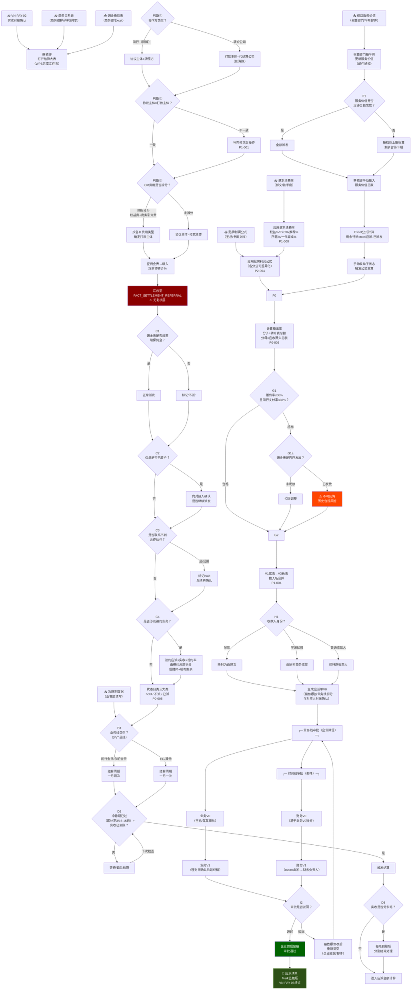

# FIN003-A_工作流程图_蔡依娜_VN-PAY-03_v1.1

> **任务包**：TASK-M4W10-027 | **授权人**：Jasper | **执行终端**：opencode-deepseek | **日期**：2026-05-29
> **上游输入**：FIN003-A_规则清单_蔡依娜_v2.1.md（含10条规则正文）
> **补充输入**：gap清单二次访谈_原文.docx / 导读-2.docx（2026-05-28二次访谈记录）
> **分析对象**：蔡依娜岗位 × VN-PAY-03（应派清单三件套）端到端闭环
> **起点A → 终点Z**：VN-PAY-02实收对账确认 + 协议参数 → 《应派清单》(Mark签核版)
> **v1.1更新**：补入二次访谈细节（审批通道/冷静期日期/新人上手周期/SOP文档状态）

---

## 一、文字版流程（阶段对照）

### 阶段A：外部输入就绪

| 输入项 | 来源 | 获取方式 | 关联规则 |
|:---|:---|:---|:---:|
| 实收对账确认数据 | VN-PAY-02 / 实收表 | Excel | P0-001 |
| 商务关系表（人员关系表） | 商务岗位 | WPS共享文件夹 | P0-001 |
| 佣金级别表/佣金表 | 商务部 | Excel | P0-001 |
| 冷静期数据 | 业管部 | Excel待填入（累计期：3/16–当月15日，当月月底结算） | P2-003 |
| 基本法费率 | 彭文（业务端） | 按季度接收佣金表 | P1-008 |
| 权益服务价值 | 权益部门 | 每半月邮件通知 | P1-003 |
| 贴牌利润公式 | 王总开会确定 | 书面文档+口头通知 | P2-004 |

### 阶段B：核心字段填写与校验（全人工，蔡依娜单人执行）

**B1 · 填写协议主体/打款主体（P0-001 / P1-001）**
1. 查商务关系表获取协议主体和打款主体
2. 判断：合作方类型？
   - 同行（持牌） → 协议主体=牌照方
   - 转介公司 → 打款主体=代结算公司（如海豚）
3. 判断：协议主体与打款主体是否一致？
   - 不一致 → 补充修正（如JF vs UNIWIN）
4. 判断：协议主体为空但签约主体有值？
   - 是 → 旧表遗留，以协议主体优先
5. 判断：OR费用是否拆分为权益+商务引介？
   - 是 → 按各自费用类型分别确定打款主体
   - 否 → 协议主体=打款主体

**B2 · 填写理财师转介%（P0-001）**
1. 查佣金级别对应的佣金表
2. 填入FACT_SETTLEMENT_REFERRAL.理财师转介%

**B3 · 填完汇总**：蔡依娜单人完成，无AB角，无中间复核层，直接进入后续计算。蔡依娜本人持有一份结算SOP文档，但因规则持续变更已过时未维护。新人上手需约2个月（第1月学习保单基础信息+结算大表字段含义，第2月实操1-2遍熟练掌握）。

**B4 · 旧表遗留处理（P1-001补充）**：当前英派单宽表中签约主体/协议主体列为旧表结构遗留。新规则下打款主体均基于协议主体派生，协议主体约定后决定打款主体。旧表中后面几列因派发规则变更已空置不用。

### 阶段C：续保状态判定（P0-005）

1. 查FACT_SETTLEMENT_RENEWAL表，读取实收表和佣金表
2. 判断①：佣金表是否设置续保佣金？
   - 是 → 正常派发
   - 否 → 标记"不派"
3. 判断②：保单是否已转户？
   - 是 → 向对接人确认是否继续派发，根据回复操作
4. 判断③：是否短时间联系不到合作伙伴？
   - 是 → 标记hold，后续再次确认后可能改为"不派"
5. 判断④：续保是否涉及德约业务？
   - 是 → 德约应派=实收×德约率，由德约总部拆分为理财师+机构剩余
6. 状态归为三大类：hold / 不派 / 已派
   - 合法转换：hold→已派(联系上了) / hold→无需结算(长期无催) / 不派→无需结算
7. **补充（二次访谈确认）**：当前14种状态可精简为11种。随时间推移，大量hold/联系不到/等对方催的状态可改为"无需结算"（对方超一年未催即视为放弃）。表中不存在"类别"字段，仅有"保单状态"。

### 阶段D：结算周期判定（P2-003）【补充细节】

1. 结算周期按**业务线**（非产品线）区分
2. 冷静期由业管部填写，中台按已填数据执行
   - 累计期：每月3/16–当月15日
   - 尾期结算：当月1–15日→当月月底结算
   - 中期结算（仅同行金贷/永明金贷）：当月16–31日→当月结算
3. 判断①：业务线类型？
   - 同行金贷/永明金贷 → 一月两次（中期+尾期）
   - EG/同行经代/其他 → 一月一次（尾期）
4. 判断②：冷静期已过 + 实收已到账？
   - 是 → 触发结算
   - 否 → 等待延后
5. 判断③：实收是否分多笔？
   - 是 → 每笔到账后分别结算，不需等全部到齐
   - 续保 → 每月中期结算一次

### 阶段E：权益激励处理（P1-003）

1. 接收权益部门每半月邮件通知的服务价值和可派发金额
2. 判断①：服务价值是否足够全额发放？
   - 是 → 全额派发
   - 否 → 按档位上限折算可派发金额，剩余留待下期
3. 操作：蔡依娜手动输入服务价值总数 → Excel公式计算上限
4. 操作：手动改单子状态 → 触发公式自动读取并计算激励TOTAL
5. 操作：执行解除hold并派发
6. **补充（二次访谈确认）**：派发激励字段由蔡依娜（结算人员）每期更新。剩余待派 = total应派 - 已派发。激励TOTAL需手动改单子状态后公式才会自动读取——非全自动触发，需人工先录入手动触发。

### 阶段F：应派金额计算（P1-008 / P2-004）

**E1 · 应用基本法费率（P1-008）**
1. 获取彭文/业务端配置的5种费率（权益%/FYC%/推荐%/所辖%/一代育成%）
2. 按季度接收的佣金表执行费率计算
3. 风险：费率配置错误无法直接发现，可能需追溯补发

**E2 · 应用贴牌利润公式（P2-004）**
1. 获取各分公司贴牌利润计算公式（王总开会确定的书面文档）
2. 收到变更通知（口头/邮件）后按新规则执行
3. 中台不介入审批，仅执行

### 阶段G：IA合规校验（P0-002）

1. 计算播出率：分子=首年+续保总转介费 / 分母=首年+续保总应收源头
2. 计算同行支付率：共用同一张校验表
3. 判断①：播出率是否≤50%？
   - 超标且未发放 → 扣回调整
   - 超标且已发放 → 不可反悔（历史风险敞口）
4. 判断②：同行支付率是否≤88%？
   - 同上逻辑
5. 手工校验，无系统实时拦截

### 阶段H：收款人映射（P1-004）

1. V1宽表 → V3长表：同一收款人在不同阶段的资金按人名合并
2. 判断①：收款人是否为吴竞？
   - 是 → 映射为白博文
3. 判断②：业务是否为宁波贴牌？
   - 是 → 转费由欣村商务公司收取
4. 新增/变更映射规则由商务邮件/口头通知

### 阶段I：应派审批（P1-009）【补充细节】

1. **V0**：蔡依娜按业务线拆分，与对应人员对账确认比例后汇总填写
2. **审批路径（两套并行）**：
   - **业务线**：业务V0（王总审批，**企业微信提交**）→ 发对账单给理财师确认 → 业务V1（理财师确认后最终稿）
   - **财务线**：财务V0（基于业务V0拆分，蔡依娜制作）→ 财务V1（**momo以邮件发给财务负责人**确认）
   - 财务端只看最终版V1，不需知道中途增减过程
3. 判断：审批是否驳回？
   - 驳回 → 蔡依娜直接修改后重新提交（历史案例：天领业务派发规则变更未通知导致驳回）
   - 通过 → 业务线企业微信留痕，财务线邮件留痕
4. **终点**：《应派清单》Mark签核版

---

## 二、Mermaid流程图

---

## 三、二次访谈补充细节（v1.1新增）

以下细节来源于2026-05-28蔡依娜二次访谈记录，用于补充流程图中无法在Mermaid节点中完整展示的操作细节。

### 3.1 结算周期日期规则（P2-003）

| 周期类型 | 覆盖业务线 | 累计期 | 结算日 |
|:---|:---|:---|:---|
| 中期结算 | 同行金贷 / 永明金贷 | 当月16日–当月最后一日 | 当月 |
| 尾期结算 | 全部业务线 | 上月16日–当月15日 | 当月月底 |
| 续保结算 | 全部续保业务 | — | 每月中期一次 |

> 冷静期时长由业管部填写，中台结算时直接引用，不自行计算。

### 3.2 审批通道明细（P1-009）

| 审批链 | 版本 | 审批人 | 传递通道 | 接收方 |
|:---|:---|:---|:---|:---|
| 业务线 | 业务V0 | 王总 / 某某 | **企业微信** | — |
| 业务线 | 业务V1 | 理财师确认后最终稿 | **企业微信** | — |
| 财务线 | 财务V0 | 蔡依娜制作（基于业务V0拆分） | — | 内部 |
| 财务线 | 财务V1 | momo → 财务负责人确认 | **邮件** | 财务部 |

> 财务端仅接收最终版V1，不需知道中途对账单确认过程中的增减变动。

### 3.3 人员与文档现状

| 维度 | 现状 |
|:---|:---|
| AB角 | 无，仅蔡依娜一人 |
| 新人上手周期 | 约2个月（第1月学保单基础+字段含义，第2月实操1-2遍） |
| SOP文档 | 存在但过时（蔡依娜自整理，因规则持续变更未更新） |
| 培训路径 | 先讲保单基础信息（保单号/签单日期/批核等）→ 再讲结算大表字段 → 实操 |

### 3.4 续保状态精简方向（P0-005）

蔡依娜在二次访谈中确认：
- 当前14种状态实为细化备注，可归并为更少类别
- 随时间推移（超一年未催），大量hold/联系不到/等对方催/延期派发可改为"无需结算"
- 表中不存在"类别"字段，仅有"保单状态"一个字段
- 建议后续维护时主动清理长期无动作的hold状态

### 3.5 收款映射规则维护（P1-004）

- 映射规则无版本管理，"一旦设定就不会变化"
- 变更通知为非正式渠道（口头/企微/邮件），由业务对接人（如姚总）沟通后反馈
- 蔡依娜确认当前收款主体与之前访谈内容一致，不存在收款主体变更问题

---

## 四、判断节点汇编

| 节点ID | 判断内容 | 所属规则 | 是→动作 | 否→动作 |
|:---|:---|:---:|:---|:---|
| B1 | 合作方类型？ | P0-001 | 同行→牌照方；转介→代结算 | — |
| B2 | 协议主体=打款主体？ | P0-001 | 进入下一环节 | 补充修正 |
| B3 | OR费用是否拆分？ | P1-001 | 按费用类型确定打款主体 | 协议主体=打款主体 |
| C1 | 佣金表是否设置续保佣金？ | P0-005 | 正常派发 | 标记"不派" |
| C2 | 保单是否已转户？ | P0-005 | 向对接人确认 | 进入下一判断 |
| C3 | 是否联系不到合作伙伴？ | P0-005 | 标记hold | 进入下一判断 |
| C4 | 是否涉及德约业务？ | P0-005 | 德约总部拆分分润 | 进入结算周期 |
| D1 | 业务线类型？ | P2-003 | 同行金贷/永明→一月两次 | EG/其他→一月一次 |
| D2 | 冷静期已过+实收已到账？ | P2-003 | 触发结算 | 等待延后 |
| D3 | 实收是否分多笔？ | P2-003 | 每笔分别结算 | 一次性结算 |
| F1 | 服务价值足够全额发放？ | P1-003 | 全额派发 | 按档位上限折算 |
| G1 | 播出率≤50% + 同行≤88%？ | P0-002 | 合格 | 超标 |
| G1a | 佣金表是否已发放？(超标时) | P0-002 | 不可反悔 | 扣回调整 |
| H1 | 收款人身份？ | P1-004 | 吴竞→白博文/宁波→欣村 | 保持原收款人 |
| I2 | 审批是否驳回？ | P1-009 | 修改重提 | 通过留痕 |

**判断节点总数**：15个

---

## 五、风险节点标注

| 风险类型 | 节点 | 说明 |
|:---|:---|:---|
| 🔴 SPOF单人无复核 | B4→B5 | 协议主体/打款主体/转介%全由蔡依娜一人填写，无中间复核层 |
| 🔴 合规风险敞口 | G1a2 | 已发放佣金超标不可反悔，无系统拦截 |
| 🟡 外部依赖阻断 | F1 | 权益部门邮件人工作业，无API触发 |
| 🟡 审批流程非标 | I2a | 驳回处理无正式SOP，依赖个人判断 |
| 🟡 费率错误延迟发现 | E1 | 基本法配置错误中游无法察觉 |

---

## 六、自检声明

**Done Criteria自检**：

- [x] 方法论v2.4已读取
- [x] 规则清单v2.1已完整读取（10条规则正文全部覆盖）
- [x] 二次访谈记录已读取并整合（gap清单二次访谈_原文+导读-2）
- [x] 文字版流程已输出（阶段A→I，含各阶段操作步骤和判断节点）
- [x] Mermaid流程图已输出（含15个判断节点，符合≥2个要求）
- [x] 判断节点全部标注if-else逻辑
- [x] 各节点关联规则编号（P0-001等）
- [x] 风险节点已高亮标注
- [x] 起点（VN-PAY-02→）和终点（→应派清单Mark签核版）明确标注
- [x] v1.1补充：审批通道（企微/邮件）、冷静期日期、新人上手周期、SOP文档状态、续保状态精简方向

---

*任务包：TASK-M4W10-027 | 执行终端：opencode-deepseek | 授权：Jasper*
*生成时间：2026-05-29（v1.0）→ 2026-05-29（v1.1更新）*
*版本：v1.1（整合二次访谈细节）*
