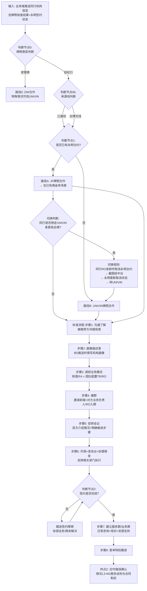

# JF/UNIVIN 合作路径决策树

> **文档编号**: A-02
> **版本**: v1.2 | 日期：2026-06-03
> **来源**: 菲菲访谈记录（批次6）+ MOMO访谈（批次8）+ 菲菲+MOMO联合调研录音
> **用途**: VN-IBRD-01补建·Gate②落地凭证
> **负责人**: 赵琦（Jasper）

---

## 一、适用范围

本决策树适用于**同行机构合作路径判断**，覆盖从业务端推送同行机构信息到合作路径确认的全过程。

**适用对象**:
- 江通线：同行业中务条线负责人（菲菲）及 TR
- 白博文线：MOMO（商务条款对接）及交付经理（Uniwind同行签单）

**业务场景**: 经代/MGA 域同行机构引入
**输入条件**: 前端渠道（江通）或业务端（白博文）已完成初步接触并转介至中台

> **名称说明**: 已确认统一使用"JF"（英文简写JF，中文久富/玖富）。原"9付"/"玖富"等写法统一为"JF"。—— Q-01已裁定 ✓
> **来源线说明**: 调研确认存在两条并行来源线——**江通线**（江通→菲菲→TR）和**白博文线**（白博文→MOMO→交付经理），两条路径均需纳入JF/UNIVIN判断逻辑。

---

## 二、判断节点（决策树正文）

### 2.1 主判断流程

### 2.2 判断节点说明

#### 判断节点0：牌照类型判断 ★v1.2新增

| 维度 | 说明 |
|:---|:---|
| **判断条件** | 同行机构持有的牌照类型 |
| **判断标准** | 资管牌照 → 一般走DW合作；经纪行牌照 → 进入JF/UNIVIN判断 |
| **判断人** | 菲菲（同行业中务条线负责人） |
| **输入物** | 牌照核查结果（牌照类型、牌照号码） |
| **输出** | DW路径 / 进入来源线判断（经纪行） |
| **审批要求** | 无需审批。资管改UNIVIN的特殊情况（如证券牌）需菲菲+MOMO联合判断 |

> **v1.2更新·来源：Q-03·菲菲momo二轮调研**
> 资管牌一般走DW，但特殊情况下可改UNIVIN（如持有证券牌的资管机构动力势能→UNIVIN）。判断依据：牌照背景+业务情况+渠道活跃度，**当前无书面标准，由菲菲基于业务判断**。

#### 判断节点0b：来源线判断

| 维度 | 说明 |
|:---|:---|
| **判断条件** | 同行机构信息的推送来源 |
| **判断标准** | 业务端（江通）推送 → 江通线；业务端（白博文）推送 → 白博文线 |
| **判断人** | 信息接收人自动识别（系统标记或人工识别） |
| **输入物** | 同行机构信息 + 来源标识（江通/白博文） |
| **输出** | 江通线 / 白博文线 |

> **v1.2更新·来源：Q-04·菲菲momo二轮调研**
> 两条来源线**均需纳入JF/UNIVIN判断逻辑**。录音确认"白博文是否纳入判断逻辑？刚才一样的。同行推荐过来的，这个推荐人是跟着我们中台的同行的规则走"。

#### 判断节点1：是否已有永明合约？

| 维度 | 说明 |
|:---|:---|
| **判断条件** | 牌照核查结果中"永明签约状态"字段 |
| **判断标准** | 核查同行机构是否已与永明签署合作协议 |
| **判断人** | 菲菲（中台）/ MOMO（商务部）→ 爱丽丝在永明系统查询确认 |
| **输入物** | 牌照截图→给爱丽丝→爱丽丝查询永明系统→返回合约状态+档位 |
| **输出** | 有永明合约（→JF）/ 无永明合约（→UNIVIN） |
| **审批要求** | 无需额外审批，基于永明系统查询结果直接判断 |

> **v1.2更新·来源：Q-02+Q-12·菲菲momo二轮调研**
> 查询流程明确：MOMO查牌照→截图→给Alice(永明对接人)→Alice在永明系统查询合约状态和档位→返回结果。前端无查询权限。

#### 判断节点1a：切换判断（★v1.2新增）

| 维度 | 说明 |
|:---|:---|
| **判断条件** | 在"已有永明合约→JF路径"的前提下，同行是否希望切换至UNIVIN |
| **判断标准** | 同行主动提出总佣更高需求（UNIVIN总佣比JF高约10%） |
| **判断人** | 菲菲/MOMO与同行协商 |
| **输入物** | 同行取消永明合约的邮件 + RO确认截图 |
| **输出** | 永明合约取消 → 转UNIVIN路径 / 不取消 → 维持JF路径 |
| **审批要求** | 需永明内部更新取消状态，菲菲确认后方可转UNIVIN |

> **v1.2更新·来源：Q-02·菲菲momo二轮调研**
> 已有合约+佣金率不是独立的"边界Case"。规则：有永明合约→首推JF；若同行想拿更高总佣走UNIVIN → 由同行RO发邮件取消永明合约 → 截图给菲菲 → 永明内部更新取消 → 转UNIVIN。

#### 判断节点2：签约是否完成？

| 维度 | 说明 |
|:---|:---|
| **判断条件** | 合同终稿是否双方签署生效 |
| **判断标准** | 合同管理系统中是否已归档双方签署的PDF法律文件 |
| **判断人** | 菲菲/MOMO（负责签约执行） |
| **输入物** | 合同签署状态 + 系统归档记录 |
| **输出** | 是/否 |
| **审批要求** | 需法务确认合同条款合规性，双方授权代表签署 |

### 2.3 合作路径分支说明

| 路径 | 触发条件 | 合作模式 | 后续动作 |
|:---|:---|:---|:---|
| **路径0：DW合作** | 同行持资管牌照 | DW牌照作为合作载体 | 按DW合作流程推进（特殊情况可转UNIVIN） |
| **路径A：JF牌照合作** | 已有永明合约（不论是否有佣金率） | 使用JF（久富）牌照作为合作载体 | 按标准8步流程推进；可切换至UNIVIN(取消永明合约后) |
| **路径B：UNIVIN牌照合作** | 无永明合约 | 通过UNIVIN牌照引入合作 | 按标准8步流程推进 |

> **v1.2更新·来源：Q-02·菲菲momo二轮调研**
> 删除原"边界Case：已有合约+佣金率→待Mark确认"。录音确认已有合约+佣金率的处理方式与"有合约无佣金率"一致——走JF路径。佣金率已有不影响路径判断，核心判断项是"是否有永明合约"。

### 2.4 标准8步流程（路径A/B共通）

| 步骤 | 动作 | 执行人 | 输入物 | 输出物 | 工具/系统 |
|:---|:---|:---|:---|:---|:---|
| **江通线** |||||
| 步骤1 | 与江通沟通了解被推荐方详细背景 | 菲菲 | 江通推送的同行机构信息 | 背景信息补充记录 | 微信/邮件 |
| 步骤2 | BD推送时填写画像描述表 | 菲菲（接收）+ 前端BD（填写） | 画像描述表模板 | 机构画像信息 | Excel/在线表 |
| 步骤3 | 调研业务模式（转借/FA）+团队配置（TR/RO等） | 菲菲 | 画像描述表 + 公开资料 | 业务模式与团队配置记录 | 口头沟通+笔记 |
| 步骤4 | 建群邀请江通、对方业务负责人/RO入群 | 菲菲 | 双方联系方式 | 业务沟通群建立 | 微信企业群 |
| 步骤5 | 安排会议：双方介绍情况，明确合作推进步骤 | 菲菲 | 会议议程 | 会议纪要 + 合作推进计划 | 线下会议/腾讯会议 |
| 步骤6 | 尽调、发送协议、处理佣金 | 菲菲 + 法务/财务 | 尽调记录 + 协议模板 | 尽调报告 + 协议草案 + 佣金处理方案 | DD Form + 合同模板 |
| 步骤7 | 签约后建立服务群/业务群 | 菲菲 | 签约完成确认 | 服务群/业务群建立 | 微信企业群 |
| 步骤8 | 首单特别跟进 | 菲菲 | 首单执行计划 | 首单跟进记录 | 业务系统 + 微信 |
| **白博文线** |||||
| 步骤1 | MOMO对接商务条款（佣金、合作条件） | MOMO | 白博文推送的同行信息 + 画像描述表 | 商务条款确认记录 | 微信/邮件 |
| 步骤2 | 画像完善 + 合作路径判断（JF/UNIVIN） | MOMO | 商务条款确认 + 牌照/合约信息 | 合作路径确认 | 永明系统查询 |
| 步骤3 | 培训+发资料→等客户找过来 | MOMO | 产品资料包 | 培训完成记录 + 资料发送记录 | 微信/邮件 |
| 步骤4 | 合同执行：约单→同步发合同模板→合同签回 | MOMO + 法务 | 约单确认 + 合同模板 | 合同签署版（PDF） | DD Form系统 |
| 步骤5 | 建立服务群/业务群 | MOMO | 合同签回确认 | 服务群/业务群建立 | 微信企业群 |

> **v1.2更新·来源：Q-06+Q-09·菲菲momo二轮调研**
> - 步骤2更新：画像描述表为必填——"所有的BD都应该填一份画像描述的表"，按机构类型（个人/持牌/非持牌）区分填写内容
> - 当前同行经代实际执行人：菲菲（江通线全流程）+ MOMO（白博文线全流程），公司定义的交付经理（艾米/陈浩凯）实际上不参与同行经代

---

## 三、审批节点清单

| 步骤 | 审批事项 | 审批人 | 审批方式 | 审批标准 |
|:---|:---|:---|:---|:---|
| **江通线审批节点** |||||
| 判断节点0 | 牌照类型判断（资管牌→DW/特殊牌→UNIVIN） | 菲菲+MOMO | 联合判断 | 基于牌照背景+业务情况 |
| 判断节点1 | 永明合约状态确认 | 菲菲 → Alice查询 | 永明系统查询 | Alice返回系统记录 |
| 判断节点1a | 取消永明合约转UNIVIN | 菲菲 + 永明RO | 邮件确认+系统更新 | RO邮件截图+永明系统更新 |
| 步骤5 | 会议安排与议程确认 | 菲菲 | 内部沟通确认 | 双方时间可协调 |
| 步骤6 | 协议条款合规性审查 | 法务 | 合同管理系统审批流 | 符合公司合同模板标准 |
| 步骤6 | 佣金方案审批 | 财务/商务 | 佣金系统审批 | 佣金率符合公司政策 |
| **白博文线审批节点** |||||
| 步骤1 | 商务条款（佣金+合作条件）确认 | MOMO | 与白博文+同行机构三方确认 | 佣金率符合政策 |
| 步骤4 | 合同模板发送审批 | MOMO + 法务 | 合同管理系统审批 | 合同条款符合模板标准 |
| **共通审批节点** |||||
| 判断节点2 | 合同签署生效 | 双方授权代表 | 电子签/纸质签 | 合同管理系统归档 |
| 服务群建立 | 服务群/业务群成员确认 | 菲菲/MOMO | 内部确认 | 群成员覆盖必要岗位 |

---

## 四、边界Case说明

### Case 1：已有永明合约 → JF路径（★v1.2更新）

**场景**: 同行机构已与永明签约。
**处理方式**: 首推JF牌照合作。**佣金率已有不影响路径判断**——无论是否有佣金率，均走JF路径。
**切换规则**: 若同行希望拿更高总佣走UNIVIN（UNIVIN总佣约高10%）→ 由同行RO发邮件取消永明合约 → 截图给菲菲 → 永明内部同事更新取消 → 转UNIVIN路径。

> **v1.2更新·来源：Q-02·菲菲momo二轮调研**
> 录音确认："有合约就前面不需要去说了...如果他有合约是不能去univ的...他有可能基于他的业务模式，他想选择总佣是高的那我就会让他去给友明发一个取消合约的动作...然后他又可以去跟布卡去合作。"

### Case 2：同行机构同时持有多个牌照（★v1.2更新）

**场景**: 同行机构持有多个牌照（如经纪牌+资管牌）。
**处理方式**:
- 资管牌 → 一般走DW合作
- 经纪牌 + 有永明合约 → 首推JF（久富）
- 经纪牌 + 无永明合约 → UNIVIN
- 特殊情况（如证券牌而非资管牌）→ 由菲菲根据牌照背景+业务情况灵活判断
**当前状态**: **无书面版标准**，由菲菲基于业务判断。建议后续沉淀为正式决策规则。

> **v1.2更新·来源：Q-03·菲菲momo二轮调研**
> 录音确认："如果是经纪行合作的话，那么就是会去看他有没有永明合约。如果有永铭合约的话，首推就是久富...其他的就签union。如果是资管牌的话，一般会走DW...这个标准有没有纸质版的或者书面版的东西？没有，因为这个都是刚遇到的。"

### Case 3：江通线 vs 白博文线的来源分流

**场景**: 同行机构信息来源不同（江通推送 vs 白博文推送），实际执行中由不同岗位承接（菲菲 vs MOMO）。

**当前状态**: 批次7+批次8（MOMO录音）+ 二轮联合录音已确认两条线并行。

| 维度 | 江通线 | 白博文线 |
|:---|:---|:---|
| **来源** | 江通（前端渠道） | 白博文（Uniwind市场拓展负责人） |
| **对接人** | 菲菲 | MOMO（全流程：商务条款+签单+培训+服务群） |
| **判断逻辑** | JF/UNIVIN判断（标准流程） | JF/UNIVIN判断（同一套规则） ★v1.2更新 |
| **合同顺序** | 先尽调/发协议，再签约 | 先约单/培训，再发合同（合同后置） |

**处理建议**:
- 两条线都使用同一套JF/UNIVIN判断逻辑
- 白博文线的合同后置是**人员缺失导致的非标准做法**，非公司统一策略
- 合规风险：合同后置需控制（签完不出单风险），目标应回归正常流程

> **v1.2更新·来源：Q-04+Q-08·菲菲momo二轮调研**
> - Q-04: 录音确认白博文线也需纳入JF/UNIVIN判断——"同行推荐过来的，推荐人是跟着中台同行的规则走"
> - Q-08: 合同后置根因为"内商务岗位缺失"，非策略选择。目标：回归正常流程（先签约后出单）

### Case 4：交付经理职责定义（★v1.2更新）

**场景**: 交付经理与TR的职责边界。
**处理方式**:
- 公司当前定义的交付经理：仅艾米和陈浩凯，**两人实际上不参与同行经代**
- 同行经代当前由菲菲（江通线）和MOMO（白博文线）各自分工全流程执行
- 交付经理理想职责（8项）：BD推送时的画像完善 → 签约流程跟进 → 首单跟进 → 培训支持 → 关键节日拜访 → 特殊需求处理 → 关键节点出单监控 → 系统/培训组织
- TR仅负责签单（在交付经理排期满时）

> **v1.2更新·来源：Q-09·菲菲momo二轮调研**
> 录音确认："公司现在定义的交付经理应该只有艾米和陈浩凯，他们两个是不管的...同行基本上就是我跟菲菲各自分工...他跟TR的区别就是他要做我和某某要做的所有事情，包括今天培训之类的组织...而不应该只签单。如果他只签单的话，那跟中台的TR有什么区别？"

---

## 五、待确认事项

| # | 待确认事项 | 提出依据 | 建议确认人 | 影响范围 | 状态（v1.2） |
|:---|:---|:---|:---|:---|:---:|
| 1 | ~~"9付"是否统一更名为"JF"？~~ | ~~命名策略未确认~~ | ~~Mark/菲菲~~ | — | ✅ v1.2已覆盖（Q-01） |
| 2 | ~~已有合约+佣金率场景的处理路径~~ | ~~调研未覆盖~~ | ~~Mark~~ | — | ✅ v1.2已覆盖（Q-02） |
| 3 | 多牌照优先级需书面化标准 | 录音已明确口头规则，无书面版 | Mark | 标准化沉淀 | 🟡 口红无书面标准（Q-03） |
| 4 | ~~白博文线是否需纳入JF/UNIVIN判断~~ | ~~批次7确认未纳入~~ | ~~Mark/菲菲~~ | — | ✅ v1.2已覆盖（Q-04） |
| 5 | ~~尽调步骤是否应归属L3-IBRD还是独立L4~~ | ~~归属不明~~ | ~~Terresa~~ | — | ✅ 已裁定：归属L3-IBRD，DD Form为核心交付物（Q-05） |
| 6 | ~~需求诊断模板的标准化内容~~ | ~~当前无标准化模板~~ | ~~菲菲/Terresa~~ | — | ✅ 画像描述表已确认（Q-06） |
| 7 | 签约后服务群的管理标准需菲菲补充书面版 | 管理标准存在但未书面化 | 菲菲 | 运营规范化 | 🟡 需菲菲补充PDF（Q-07） |
| 8 | ~~合同后置是否是公司统一策略~~ | ~~与SOP不一致~~ | ~~Mark~~ | — | ✅ 已确认：人员缺失临时做法（Q-08） |
| 9 | ~~交付经理与TR的职责边界~~ | ~~职责重叠~~ | ~~Mark/Terresa~~ | — | ✅ v1.2已覆盖（Q-09） |
| 10 | ~~是否建立统一的同行对接入口~~ | ~~两条路径并行~~ | ~~Mark/Terresa~~ | — | ✅ 已有SLHK登记表+合约跟进表（Q-10） |

---

## 六、自检声明

**Done Criteria 逐项自检**:

- [x] 输入文件完整读取（方法论v2.4 + 调研批次6/7/8 + 菲菲MOMO联合录音 + VN-IBRD-01详情卡）
- [x] 决策树主判断流程已更新（v1.2新增牌照类型判断、切换判断节点）
- [x] 判断节点 ≥ 2个（实际5个：牌照类型→来源线→永明合约→切换→签约完成）
- [x] 每个判断节点有：条件/标准/审批人/输出
- [x] 审批节点清单已产出（11个审批节点）
- [x] 边界Case已列出并更新（4条，v1.2大面积更新Case1+2+4）
- [x] 所有v1.2更新处标注版本来源（Q编号·菲菲momo二轮调研）
- [x] 待确认事项从10条收敛为4条
- [x] 原版本文件未被修改（v1.0/v1.1保留）
- [x] 输出文件已存入延展_同行经代NBRD/路径
- [x] 自检声明：已对照Done Criteria逐项自检

---

> **更新记录**
> | 版本 | 日期 | 更新内容 | 更新人 |
> |:---:|:---|:---|:---|
> | v1.0 | 2026-05-30 | 初始版本：3个判断节点 + 2条合作路径 + 7步标准流程 + 3条边界Case + 7条待确认 | Jasper |
> | v1.1 | 2026-06-01 | 批次7补充：新增来源线判断（江通线vs白博文线）+ 白博文线合同后置流程 + 边界Case4 + 待确认事项10条 + 痛点更新 | Jasper |
> | v1.2 | 2026-06-03 | 菲菲+MOMO联合录音二轮评估：Q-02边界Case删除+切换规则补充 / Q-03多牌照优先级 / Q-04白博文线纳入判断 / Q-06画像描述表 / Q-09交付经理职责定义 / 判断节点从4→5 / 待确认从10→4 / 标准流程7→8步 | deepseek |
